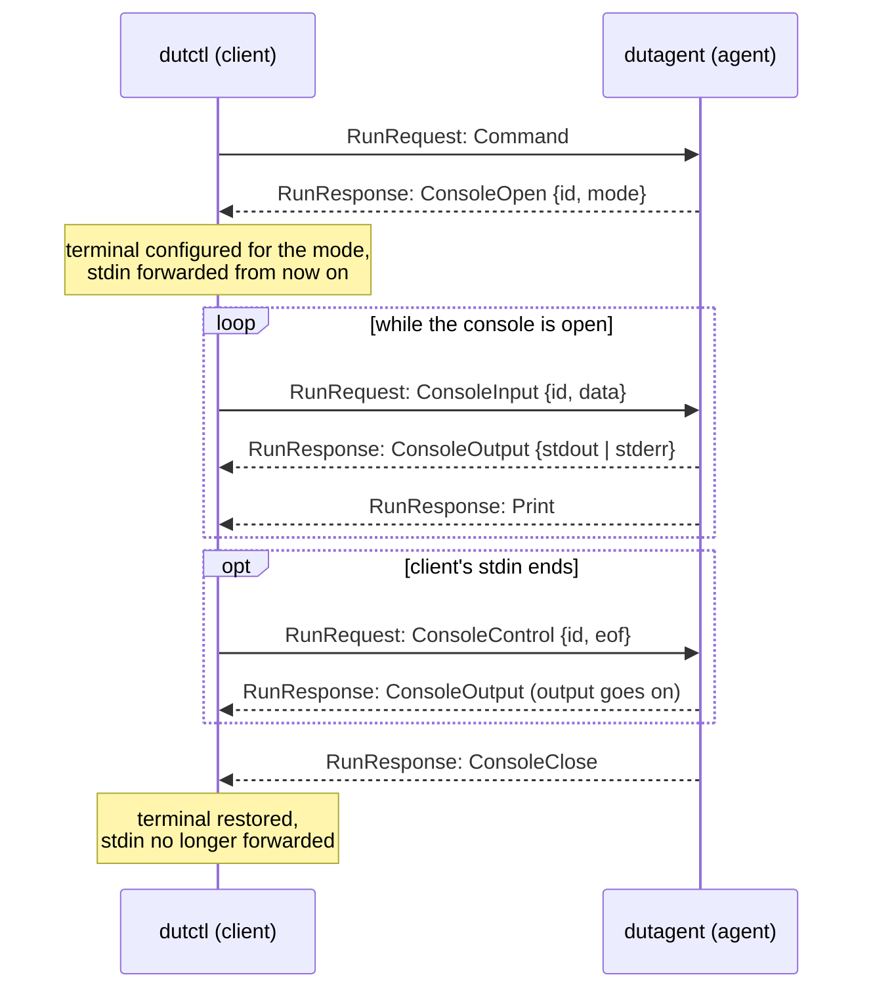

# System Overview

DUT Control (DUTCTL) is a decentralized client-agent architecture as shown here:

Multiple Devices-Under-Test (DUTs) can be connected and physically wired to one DUT Agent (DA) which performs the
hardware interaction. If the system scales, multiple DUT Agents can be used. Users control DUTs through DUT Client,
which connects (remotely) to a DUT Agent and builds the system's user interface. 

In a future release, there will be DUT Server, which abstracts the DUT Client to DUT Agent connections and improves the
usability in larger systems. From the DUT Client side, there is no difference between talking to a DUT Agent or the DUT
Server in terms of controlling the hardware.

## Device-Under-Test (DUT)
The machine or hardware you want to operate.

## DUT Client (dutctl)
This is the actual application running on the user's machine. It provides a command line interface to issue a task.
This client app, thought, has no knowledge about the connected DUT's and their available control operations. That
information is provided by the agent on request. 

## DUT Agent (DA)
The DUT Agent is a service designed to run on a single board computer, which can handle the wiring to the DUT (power
control, reset, flasher, serial console, etc.) The specifics and supported operation for the wired DUTs are feed to the
DUT Agent via a [configuration file](./dutagent-config.md). How the agent and its commands end, on stop signals,
client cancellation and failures, is described in [dutagent-shutdown.md](./dutagent-shutdown.md).

## DUT Server
The DUT Server is designed to let the project scale. Its basic purpose is to maintain a table with the DUT to DUT Agent
relations. Its interface towards a DUT Client is the same as the one from a DUT Agent. This way there is no difference
from the client side to which instance to talk to. Additionally, the DUT Server could expose further interfaces like a
REST API to observe the fleet of DUTs. 

# Communication Design

The distributed entities of the DUT Control system communicate via Remote Procedure Calls (RPCs), which are defined in
`protobuf/dutctl/v1/dutctl.proto`. The communication is always initiated by the client, and there are three calls 
defined in the RPC service that a client can issue to the agent: 
1) List, to list the available connected devices 
2) Commands, to learn about the available commands of a given device
3) Run, to execute a command on a device

While the 1) and 2) are quite straight forward, the Run-RPC is a bidirectional stream, where both the client and the
agent are sending multiple messages until the end of the command execution. According to the protobuf definition, during
a Run-RPC stream, the client and the agent are sending RunRequests and RunResponses, respectively. These messages are
abstractions for different types of messages being sent between client and agent, and the following convention applies:

The first RunRequest sent by the client must always be a Command message. Depending on the module implementation of the
executed command, there are the following scenarios for the further communication during the Run-RPC stream:

**Print**: After the initial RunRequest with a Command message by the client, the agent sends one or many RunResponses
being Print messages. This type of messages is usually good for status updates of basic commands, which do not require
further interaction or input. Print messages may be sent at any time, also while a console is open; the client shows
Print and console output in the order received.

**Console**: A console is how a module and the user interact through the client's standard streams. The agent opens it
with a RunResponse being a ConsoleOpen message, which carries the console's mode (LINE or RAW) and an id that is unique
within the run. From then on until the console ends, the client forwards its standard input to the agent as
ConsoleInput messages marked with that id, and the agent sends the module's standard output and standard error to the
client as ConsoleOutput messages. The payload is opaque: no hop alters it. The console ends with a ConsoleClose message
when the module returns; the end of the stream closes a console that is still open. The client forwards input only
while a console is open and marks it with the console's id; the agent discards input that is not marked for the open
console and never queues it for a console opened later. Input the client had already read when a console closed
reaches the next console, as typeahead does. A module has one console at a time, so a second ConsoleOpen within a run
implies the end of the first console.

When the client's standard input ends (a pipe at its end, Ctrl-D in a line console), the client sends its pending input
and then a ConsoleControl message with an eof event. The module's input then reports end of file, while the console's
output and any file transfers go on; the stream itself stays open until the command ends.

The mode tells the client how the module uses its console, so that the client can configure a terminal accordingly:

- **LINE**: the module reads newline-terminated lines of text. The terminal is left as it is: line editing and local
  echo are done by the terminal, Enter sends the line, and Ctrl-C interrupts the client as usual. This is the mode for
  prompts, question-and-answer interaction and input piped to a process.
- **RAW**: the module consumes bytes as typed and produces bytes for a terminal, as a serial port does. The terminal is
  switched to raw mode: every key, Ctrl-C and Escape included, is sent at once and unchanged, and output is written to
  the terminal as received. Since Ctrl-C now goes to the device, the client keeps a local escape key: `Ctrl-A x` ends
  the session, `Ctrl-A Ctrl-A` sends a literal Ctrl-A, and `Ctrl-A e` toggles a local echo for devices that do not
  echo themselves. The client prints a hint with these keys on standard error when it enters raw mode.

Raw mode is used only when the client's standard input is a terminal and the output format is text. Otherwise, for
example with input piped from a file or in CI, the input is forwarded as it is read, in chunks, with no raw mode
anywhere.

**File download to the client**: After the initial RunRequest with a Command message by the client, for commands
producing any artifacts, these can be downloaded to the client, with a RunResponse being a File message. Downloads can
happen multiple times and can be mixed with Print messages, consoles and file uploads.

**File Upload to the agent**: After the initial RunRequest with a Command message by the client, for commands needing
any artifacts, these can be uploaded to the agent, with a RunResponse being a FileRequest message and the client
answering with a RunRequest being a File message. Uploads can happen multiple times and can be mixed with Print
messages, consoles and file downloads. Note that while a console is open, a file transfer waits behind the module's
reading of the console input.

> [!IMPORTANT]
> The console protocol described here replaced the earlier single Console message. While DUT Control is in alpha, no
> compatibility between versions is kept across such a change: update dutctl and dutagent together, and do not run
> mixed versions.
