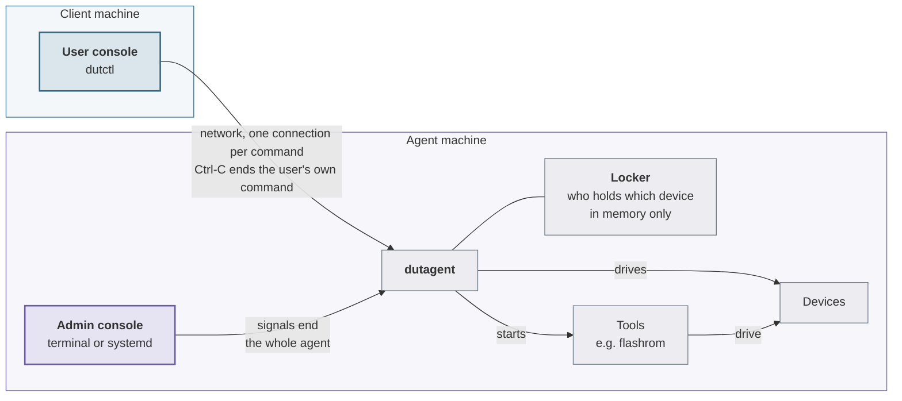
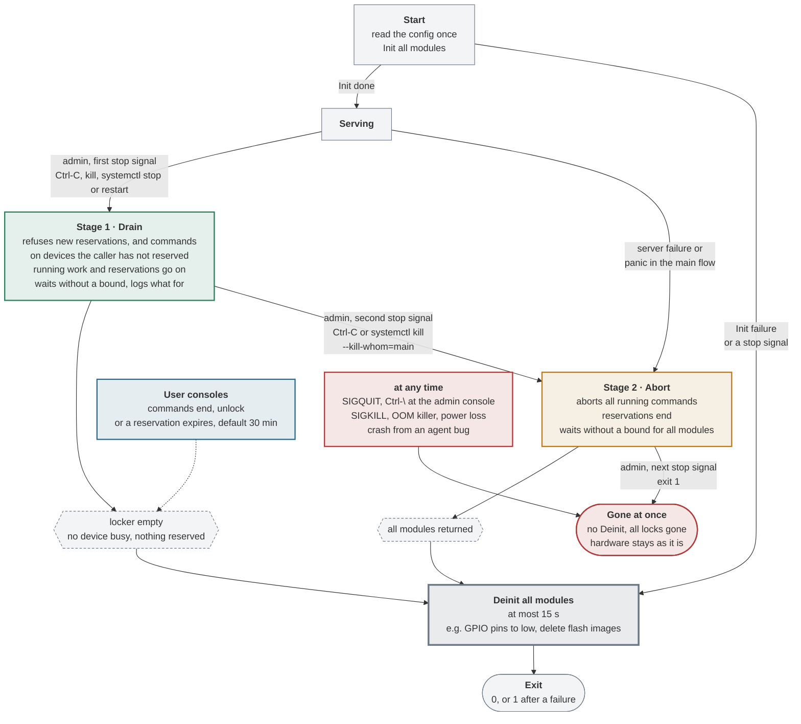

# How commands and the agent end

For admins and advanced users: who can end a command or the whole agent, what
happens to the device and its lock, which times apply, and when the modules are
deinitialized.

- **User console**: the terminal on the client machine that runs `dutctl`. It
  reaches the agent only over the network and can end at most its own command.
- **Admin console**: a terminal or systemd on the agent machine. Only from here
  can the agent itself be ended, with signals.
- **Stop signal**: `SIGTERM`, `SIGINT` (Ctrl-C) or `SIGHUP`. They count
  together, and each one takes the agent from its stage to the next: the first
  starts stage 1, the next stage 2, and one during stage 2 exits at once. So
  once a failure has started stage 2, the next stop signal exits. The OS may
  merge identical signals sent in a quick burst: send the next one after the
  agent has logged the previous one. An agent started with `SIGINT` or `SIGHUP`
  ignored, as by `nohup` or a script that starts it in the background, keeps
  ignoring them, so it outlives its terminal.
- **Lock**: per device, a Busy hold while a command runs, and optionally a
  reservation taken with `dutctl <device> lock`. Both live in memory only and
  are gone whenever the agent ends.

## Who can end what

A user ends at most their own command, from their console. Only the admin on
the agent machine ends the agent.

## A command ends

A command ends when its modules have returned, on their own or after an abort.
Its client can abort it, with Ctrl-C, by losing the connection or by breaking
the stream, and so can the agent in stage 2. The abort reaches the module
through its context: a flash tool gets `SIGTERM` and, after 10 s, `SIGKILL`;
other tools get `SIGKILL` at once. The device stays busy until the module has
really returned and its output is delivered, not until the client is gone, so
a client that stops reading keeps it busy too. The user's own reservation
stays, and Deinit never runs at the end of a command. The table under "All
causes" lists every case.

## The agent ends

The three stages, failures at start and while serving, and every way to Deinit.
Failures while serving go through stage 2, so Deinit never runs beside a
running module. Init gets a context that ends after 5 min or with the first
stop signal, but is not cut short: a module whose Init ignores its context
holds the start, and with it the agent, until it returns.

In stage 1, the owner of a reservation may still run commands on that device
and extend the reservation, so a job can run to its end. To end a single
forgotten reservation instead of aborting every command, use
`dutctl <device> unlock force`.

Under a service manager, the unit must leave the stop to dutagent; the example
unit in `packaging/` does, and
[packaging/README.md](../packaging/README.md#stopping-and-restarting) shows how
`systemctl stop`, `restart` and `kill --kill-whom=main` map to the stages.

## When Deinit runs

Deinit runs:

- after stage 1, once the locker is empty;
- after stage 2, once all modules have returned;
- after a failure or a stop signal during the start;
- after a server failure or a panic in the main flow, through stage 2.

It always runs only once no module runs any more, and for at most 15 s: a
module whose Deinit has not returned by then is left behind. If Deinit fails or
runs out of time, the agent exits with 1 and logs "UNKNOWN STATE".

Deinit never runs at the end of a command, on a stop signal during stage 2 or
`SIGQUIT`, or on `SIGKILL`, the OOM killer, a crash or a power loss. Then only
Init at the next start brings the hardware back to its initial state. What
Deinit does, for example: drive GPIO pins low, which can switch a device off;
delete flash images; close IPMI connections.

## All causes

| Trigger | What ends | Device and lock | Deinit | What the user sees |
|---|---|---|---|---|
| **User console, client machine** | | | | |
| Ctrl-C in `dutctl` | the user's own command | busy until the module has returned: at once for most tools, up to 10 s for flash; the user's reservation stays | no | the prompt at once; retrying at once is refused until the device is free |
| `dutctl <device> unlock` | the user's own reservation | a running command stays busy | no | – |
| `dutctl <device> unlock force` | someone else's reservation | never ends a running command | no | an error if the device is only busy |
| command refused | nothing starts | unchanged | no | `FailedPrecondition`: held, reserved, already running or agent shutting down; `NotFound`, `InvalidArgument` |
| **Network** | | | | |
| connection lost | the command, once the agent notices: after about 2.5 min, up to about 15 min with data in flight | busy until then | no | a connection error |
| **Within the command, on the agent machine** | | | | |
| module done | the command | free | no | output, exit code 0 |
| module error or panic | the command; later modules do not run | free | no | `Aborted` "module failed: …", for a panic "module failed: module panicked: …" |
| stream or protocol error | the command | busy until the module has returned | no | the stream's error |
| module does not return after an abort | nothing | stays busy, the agent log warns every 10 s; `unlock force` does not help | no | new commands are refused until the admin ends the agent |
| reservation expires | the reservation, default 30 min, chosen by the user | free, unless a command runs | no | – |
| **Admin console, agent machine** | | | | |
| first stop signal: Ctrl-C in the terminal, `kill`, `systemctl stop` or `restart`, reboot | the agent enters stage 1 | commands and reservations go on | afterwards | new reservations, and commands on devices the user has not reserved: `FailedPrecondition` "dutagent is shutting down…"; a reservation's owner may still run commands on it and extend it |
| stop signal during stage 1: Ctrl-C, `systemctl kill --kill-whom=main` | stage 2: all running commands | busy until all modules have returned; reservations end | afterwards | `Aborted` "module execution aborted: dutagent is shutting down" |
| stop signal during stage 2, `SIGQUIT` (Ctrl-\\), `kill -9` | the agent at once; exit 1 after the stop signal | all locks gone, hardware stays as it is; without a service manager that kills them, the tools it started may keep running | no | the running command fails with a connection error, then "cannot reach dutagent" |
| **Within the agent, failures** | | | | |
| Init fails, or a stop signal during the start | the start | – | yes | "cannot reach dutagent" |
| server failure, e.g. address in use, or a panic in the main flow | the agent, through stage 2 | busy until all modules have returned | afterwards | the connection drops |
| Deinit fails or takes over 15 s | – | hardware state unclear, log "UNKNOWN STATE" | cut short | – |
| crash from an agent bug, a panic in a background goroutine | the agent at once | all locks gone | no | the connection drops |
| **Kernel and hardware** | | | | |
| OOM killer, power loss | the agent at once | all locks gone, hardware stays as it is | no | the connection drops |
